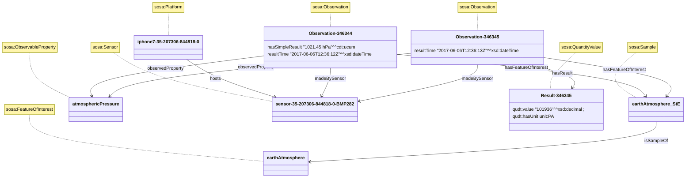

# FAIRiTRASH
Sandbox for internal FAIRiCUBE work

```mermaid
classDiagram
   class earthAtmosphere{
    }
    note for earthAtmosphere "sosa:FeatureOfInterest"
    class earthAtmosphere_StE{
    }
    note for earthAtmosphere_StE "sosa:Sample"
   earthAtmosphere_StE --> earthAtmosphere: isSampleOf

    class atmosphericPressure{
    }
    note for atmosphericPressure "sosa:ObservableProperty"
    class iphone7-35-207306-844818-0{
    }
    note for iphone7-35-207306-844818-0 "sosa:Platform"
    class sensor-35-207306-844818-0-BMP282{
    }
    note for sensor-35-207306-844818-0-BMP282 "sosa:Sensor"
   iphone7-35-207306-844818-0 --> sensor-35-207306-844818-0-BMP282: hosts


    class Observation-346344{
      hasSimpleResult "1021.45 hPa"^^cdt:ucum
      resultTime "2017-06-06T12:36:12Z"^^xsd:dateTime
    }
    note for Observation-346344 "sosa:Observation"
    Observation-346344 --> atmosphericPressure: observedProperty
    Observation-346344 --> earthAtmosphere_StE: hasFeatureOfInterest
    Observation-346344 --> sensor-35-207306-844818-0-BMP282: madeBySensor

    class Observation-346345{
      resultTime "2017-06-06T12:36:13Z"^^xsd:dateTime
    }
    note for Observation-346345 "sosa:Observation"
   class Result-346345{
      qudt:value "101936"^^xsd:decimal ;
      qudt:hasUnit unit:PA
   }
    note for Result-346345 "sosa:QuantityValue"
    Observation-346345 --> atmosphericPressure: observedProperty
    Observation-346345 --> earthAtmosphere_StE: hasFeatureOfInterest
    Observation-346345 --> sensor-35-207306-844818-0-BMP282: madeBySensor
    Observation-346345 --> Result-346345: hasResult


```
